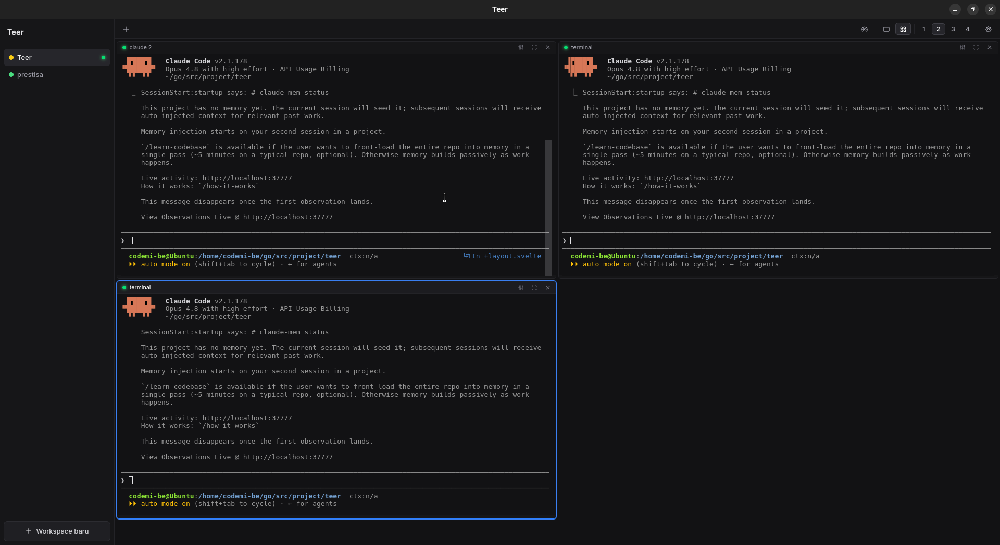

# Teer

**Terminal Workspace Manager** — a desktop app for developers to organize and run multiple CLI sessions grouped by project workspace.

> Built with [Wails v3](https://v3.wails.io/) (Go + Svelte + TypeScript)




---

## What is Teer?

Developers constantly juggle multiple terminal sessions: dev servers, watchers, log tailers, database clients, SSH sessions, build tools. These sessions scatter across tabs and windows with no project context.

**Teer** solves this with a **workspace model** — group your terminals by project, persist their definitions across restarts, and bring everything back in one click.

Think of it as a terminal emulator (like Tabby or Wave) combined with VS Code's workspace concept, built specifically for managing running CLI processes.

---

## Features

- **Workspaces** — create named workspaces (with color labels) for each project
- **Multiple terminals per workspace** — displayed as tabs, all full PTY (supports vim, htop, top, etc.)
- **Persistent layout** — workspace and session definitions survive app restarts
- **Keyboard-driven** — command palette + shortcuts for fast navigation
- **Lightweight** — uses OS WebView (no bundled Chromium), target idle RAM < 150 MB
- **Full ANSI support** — powered by xterm.js with fit, search, and web-links addons

> **Note:** The binary and Go module are named `teer` (lowercase). "Teer" is the display name of the application.

---

## Tech Stack


| Layer             | Technology                                  |
| ----------------- | ------------------------------------------- |
| Desktop framework | Wails v3 (alpha.82)                         |
| Backend           | Go 1.25+                                    |
| PTY / shell       | `creack/pty` (Linux/macOS)                  |
| Frontend          | Svelte 5 + TypeScript                       |
| Terminal renderer | xterm.js + fit/search/web-links addons      |
| Build tool        | Vite                                        |
| Config storage    | JSON at `~/.config/teer/`                   |
| FE ↔ BE comms     | Wails RPC bindings + Events (streaming I/O) |


---

## Installation

### Quick Install (Linux / macOS)

```bash
curl -fsSL https://raw.githubusercontent.com/triadmoko/teer/main/install.sh | bash
```

Binary is installed to `~/.local/bin/teer` (no sudo required). The installer automatically adds `~/.local/bin` to `PATH` in `~/.bashrc` / `~/.zshrc` if not already present — open a new terminal after install.

Or install a specific version:

```bash
curl -fsSL https://raw.githubusercontent.com/triadmoko/teer/main/install.sh | bash -s -- --version v0.1.0
```

> **Note:** When piping, pass the version as an argument (`bash -s -- --version ...`). Setting `TEER_VERSION=...` before `curl` does **not** work — the env var dies with the `curl` process and never reaches `bash`, so the installer falls back to the GitHub `releases/latest` API. If you prefer the env var, put it before `bash`: `... | TEER_VERSION=v0.1.0 bash`.

Custom install directory:

```bash
INSTALL_DIR=~/.local/bin curl -fsSL https://raw.githubusercontent.com/triadmoko/teer/main/install.sh | INSTALL_DIR=~/.local/bin bash
```

**Linux system dependency** (required for WebKit):

```bash
# Debian/Ubuntu
sudo apt install libwebkit2gtk-4.1-0

# Fedora
sudo dnf install webkitgtk6.0
```

### Install from Source (for developers / contributors)

If you have already cloned the repository, use this script to build and install directly from local source — no need to wait for a new release.

**Prerequisites:** Go 1.25+, Node.js 18+, [Task CLI](https://taskfile.dev), [Wails v3 CLI](https://v3.wails.io/getting-started/installation)

```bash
git clone https://github.com/triadmoko/teer
cd teer
./install-dev.sh
```

Binary is installed to `~/.local/bin/teer`. After `git pull`, re-run `./install-dev.sh` to update.

### Quick Install (Windows)

Run in PowerShell:

```powershell
irm https://raw.githubusercontent.com/triadmoko/teer/main/install.ps1 | iex
```

The binary is installed to `%LOCALAPPDATA%\Programs\teer\teer.exe` and added to your user `PATH`.

### Uninstall

**Linux / macOS:**

```bash
curl -fsSL https://raw.githubusercontent.com/triadmoko/teer/main/uninstall.sh | bash
```

Also remove config:

```bash
curl -fsSL https://raw.githubusercontent.com/triadmoko/teer/main/uninstall.sh | bash -s -- --purge-config
```

> The uninstaller removes the binary from both `~/.local/bin` and `/usr/local/bin` (legacy install location).

**Windows** (PowerShell):

```powershell
irm https://raw.githubusercontent.com/triadmoko/teer/main/uninstall.ps1 | iex
```

Also remove config:

```powershell
$env:TEER_PURGE_CONFIG = "1"; irm https://raw.githubusercontent.com/triadmoko/teer/main/uninstall.ps1 | iex
```

Config is stored at `~/.config/teer/` (Linux/macOS) or `%APPDATA%\teer\` (Windows).

### Manual Install

Download the latest binary from [Releases](https://github.com/triadmoko/teer/releases) and place it in a directory on your `PATH`.


| Platform                        | Asset                      |
| ------------------------------- | -------------------------- |
| Linux x64                       | `teer-linux-amd64`         |
| macOS Universal (arm64 + amd64) | `teer-macos-universal.zip` |
| Windows x64                     | `teer-windows-amd64.exe`   |


---

## Getting Started

### Prerequisites (for building from source)

- Go 1.25+
- Node.js 18+
- [Wails v3 CLI](https://v3.wails.io/getting-started/installation)
- Linux, macOS, or Windows

### Development

```bash
task dev
# or
wails3 dev -config ./build/config.yml
```

Hot-reload active for both frontend (Vite) and backend (Go).

### Build

```bash
task build
```

Produces a binary in `bin/`.

### Other tasks

```bash
task run            # run production build
task package        # package for distribution
task build:server   # headless HTTP server mode (no GUI)
task run:server     # run server mode
task build:docker   # build Docker image for server mode
task run:docker     # build and run Docker image
```

---

## Architecture

### Terminal I/O Flow

```
[xterm.js in Svelte]  --(keystroke)-->  WriteToSession(id, data)
        ^                                          |
        |                                          v
   Events.On(output)  <--(stream)--  Go: read PTY  -->  shell (bash/zsh)
```

Each session runs as a goroutine reading from its PTY, emitting `session:<id>:output` events to the frontend. Resize and write are separate Wails bindings.

### Data Model

```
Application
└── Workspace  (name, color, default cwd, env vars)
    └── Session[]  (name, shell, cwd, env, autoStart)
        └── Runtime state: PTY, status (running/exited), PID
```

Config is stored as JSON at `~/.config/teer/` with `0600` permissions. Terminal scrollback is not persisted in v1.

> Sessions are not preserved after Teer closes — PTY processes are killed on quit. For long-lived sessions (e.g. SSH), use a host-side `tmux` via `startupCommand`.

---

## Non-Goals (v1)

- Not a remote multiplexer (no tmux/screen on the server side)
- Not an IDE or code editor
- No cloud sync or multi-device support
- No real-time collaboration or shared sessions
- No plugin marketplace

---

## License

MIT